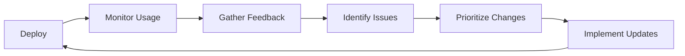

## Why Most Dashboards Fail

Let's face it: most dashboards are digital graveyards. They're built with enthusiasm, launched with fanfare, and then slowly abandoned as users revert to spreadsheets and gut feelings.

After designing hundreds of dashboards across industries, I've seen the patterns. The good news? Creating effective dashboards isn't rocket science—it just requires following proven principles and avoiding common traps.

## The Dashboard Success Formula

Successful dashboards share three characteristics:

1. **Clear Purpose**: They answer specific questions
2. **User Focus**: They're designed for actual workflows  
3. **Actionable Insights**: They drive decisions, not just display data

Let's dive into the practices that make this happen.

## 1. Start with Questions, Not Data

### The Problem
Too many dashboards begin with "We have all this data, let's visualize it!" This backwards approach creates cluttered, purposeless displays.

### The Solution
Begin with the decisions your users need to make:

- What actions will they take based on this information?
- What questions do they need answered?
- What's their current workflow?

### Example: Sales Dashboard

❌ **Wrong Approach**: "Let's show all sales metrics"

✅ **Right Approach**: 
- "Which territories are underperforming?"
- "What products need inventory replenishment?"
- "Which deals need immediate attention?"

```yaml
User Story Format:
As a [role]
I need to [see/understand/analyze]
So that I can [take action/make decision]
```

## 2. Follow the 5-Second Rule

### The Principle
Users should understand the main message within 5 seconds of viewing your dashboard.

### Implementation Techniques

**Visual Hierarchy**
1. **Primary KPI**: Largest, top-left position
2. **Supporting Metrics**: Medium size, logical flow
3. **Details**: Smaller, available on demand

**Example Layout**:
```
┌─────────────────────────────────────┐
│  PRIMARY KPI (Revenue: $2.4M)       │
├─────────────┬───────────┬───────────┤
│ Metric 1    │ Metric 2  │ Metric 3  │
├─────────────┴───────────┴───────────┤
│         Main Visualization           │
├─────────────────────────────────────┤
│ Supporting Charts │ Detailed Table   │
└─────────────────────────────────────┘
```

### Real-World Application

Before: 

- 47 metrics competing for attention
- No clear story
- Users spend 3+ minutes finding what they need

After:

- 3 primary KPIs prominently displayed
- Progressive disclosure for details
- 5-second comprehension achieved

## 3. Choose the Right Chart for Your Data

### The Chart Selection Matrix

| Data Type | Best Charts | Avoid |
|-----------|------------|-------|
| Trends over time | Line, Area | Pie, 3D |
| Comparisons | Bar, Column | Line, Radar |
| Parts of whole | Stacked bar, Treemap | Pie (if >5 parts) |
| Relationships | Scatter, Bubble | 3D, Complex |
| Geographic | Choropleth, Points | 3D globes |

### Common Mistakes to Avoid

**1. Pie Chart Abuse**
```python
# Bad: 15 slices in a pie chart
plt.pie(data, labels=categories[:15])

# Good: Top 5 + "Other"
top5 = data.nlargest(5)
other = data[5:].sum()
plt.bar(top5.index + ['Other'], top5.values + [other])
```

**2. 3D Distortions**
- 3D charts distort perception
- Harder to read accurate values
- No added informational value

**3. Dual Axes Confusion**
- Use only when scales are comparable
- Always label clearly
- Consider small multiples instead

## 4. Embrace White Space

### Why White Space Matters
- Reduces cognitive load
- Improves readability
- Creates visual hierarchy
- Looks professional

### The 40% Rule
Aim for 40% of your dashboard to be white space:
- Margins between components
- Padding within charts
- Space around text
- Breathing room for eyes

### Before vs. After

```css
/* Before: Cramped */
.dashboard-card {
  margin: 2px;
  padding: 5px;
}

/* After: Breathable */
.dashboard-card {
  margin: 20px;
  padding: 20px;
}
```

## 5. Use Color Strategically

### Color Best Practices

**1. Limit Your Palette**
- Maximum 5-7 colors
- Use shades for variation
- Reserve bright colors for emphasis

**2. Consider Color Blindness**
- 8% of men are color blind
- Use ColorBrewer palettes
- Add patterns or labels

**3. Semantic Colors**
```css
:root {
  --success: #28a745;
  --warning: #ffc107;
  --danger: #dc3545;
  --info: #17a2b8;
  --neutral: #6c757d;
}
```

### Color Psychology in Dashboards

| Color | Use For | Avoid For |
|-------|---------|-----------|
| Green | Positive metrics, growth | Warnings |
| Red | Alerts, negative values | Decorative elements |
| Blue | Neutral information | Food/appetite related |
| Orange | Calls-to-action | Background colors |
| Gray | Secondary information | Primary metrics |

## 6. Design for Your Actual Users

### User Personas for Dashboards

**Executive Ellen**
- Needs: High-level summary
- Time: 30 seconds
- Device: Mobile phone
- Solution: Executive summary view

**Analyst Alex**
- Needs: Detailed exploration
- Time: 30+ minutes
- Device: Dual monitors
- Solution: Drill-down capabilities

**Manager Mike**
- Needs: Team performance
- Time: 5 minutes
- Device: Laptop
- Solution: Comparative views

### Responsive Design Considerations

```css
/* Mobile First */
@media (max-width: 768px) {
  .dashboard-grid {
    grid-template-columns: 1fr;
  }
  .detailed-table {
    display: none;
  }
}

/* Desktop Enhancement */
@media (min-width: 1200px) {
  .dashboard-grid {
    grid-template-columns: repeat(4, 1fr);
  }
}
```

## 7. Progressive Disclosure

### The Principle
Show overview first, details on demand.

### Implementation Hierarchy

1. **Level 1**: Key metrics only
2. **Level 2**: Trends and comparisons
3. **Level 3**: Detailed breakdowns
4. **Level 4**: Raw data access

### Interactive Example

```javascript
// Progressive disclosure pattern
function Dashboard() {
  const [detailLevel, setDetailLevel] = useState(1);
  
  return (
    <>
      <SummaryKPIs />
      {detailLevel >= 2 && <TrendCharts />}
      {detailLevel >= 3 && <DetailedTables />}
      {detailLevel >= 4 && <RawDataExport />}
      
      <DetailToggle 
        level={detailLevel}
        onChange={setDetailLevel}
      />
    </>
  );
}
```

## 8. Make It Fast

### Performance Targets
- Initial load: < 3 seconds
- Interactions: < 100ms
- Filter updates: < 1 second
- Export generation: < 10 seconds

### Optimization Techniques

**1. Data Aggregation**
```sql
-- Instead of sending raw data
SELECT * FROM sales;  -- 1M rows

-- Pre-aggregate
SELECT 
  DATE_TRUNC('day', sale_date) as day,
  SUM(amount) as total,
  COUNT(*) as transactions
FROM sales
GROUP BY 1;  -- 365 rows
```

**2. Lazy Loading**
- Load visible charts first
- Defer below-fold content
- Progressive enhancement

**3. Caching Strategy**
- Cache static datasets
- Refresh based on data velocity
- Client-side caching for filters

## 9. Tell a Story

### The Dashboard Narrative Arc

1. **Hook**: What's the main insight?
2. **Context**: How does it compare?
3. **Detail**: What's driving it?
4. **Action**: What should I do?

### Storytelling Techniques

**Annotations**
- Highlight significant events
- Explain anomalies
- Provide context

**Smart Titles**
```
❌ "Sales Chart"
✅ "Sales Up 23% vs Last Quarter"

❌ "Customer Distribution"
✅ "80% of Revenue from Top 20% of Customers"
```

**Guided Analysis**
- Number insights for easy reference
- Use callout boxes
- Create a logical flow

## 10. Test, Measure, Iterate

### Dashboard Success Metrics

1. **Usage Analytics**
   - Daily active users
   - Session duration
   - Feature utilization
   - Export frequency

2. **User Feedback**
   - NPS scores
   - Feature requests
   - Support tickets
   - User interviews

3. **Business Impact**
   - Decision speed
   - Action taken
   - ROI metrics
   - Error reduction

### Continuous Improvement Process



## Real-World Success Story

### Before: The "Everything Dashboard"
- 73 widgets on one screen
- 12% adoption rate
- Users exported to Excel anyway
- No mobile support

### After: The Focused Solution
- 3 role-based views
- 87% adoption rate
- 50% reduction in Excel exports
- Full mobile responsiveness

### Key Changes Made:
1. User interviews revealed actual needs
2. Reduced metrics from 73 to 12 essential
3. Created mobile-first design
4. Added export functionality where needed
5. Implemented usage tracking

## Common Pitfalls to Avoid

### 1. The "Executive Request" Trap
Just because the CEO wants to see everything doesn't mean everything should be on one screen.

### 2. The "Real-Time" Obsession
Not everything needs real-time updates. Match refresh rates to decision frequency.

### 3. The "Gauge Overload"
Gauges waste space. A simple number with trend arrow is often better.

### 4. The "Traffic Light Syndrome"  
Red/Yellow/Green everywhere makes nothing stand out.

### 5. The "Kitchen Sink" Approach
More features ≠ better dashboard. Focus wins.

## Your Dashboard Checklist

Before launching any dashboard, verify:

- [ ] **Purpose Clear**: Can users state the dashboard's purpose?
- [ ] **5-Second Test**: Is the main message immediately clear?
- [ ] **Mobile Ready**: Does it work on phones/tablets?
- [ ] **Performance**: Loads in under 3 seconds?
- [ ] **Actionable**: Clear next steps from insights?
- [ ] **Accessible**: Works for color-blind users?
- [ ] **Documented**: Help/training available?
- [ ] **Maintainable**: Data refresh automated?
- [ ] **Measured**: Usage tracking implemented?
- [ ] **Tested**: User acceptance confirmed?

## Conclusion

Great dashboards don't happen by accident. They're the result of thoughtful design, user empathy, and continuous refinement. By following these practices, you'll create dashboards that not only look good but actually drive business value.

Remember: the best dashboard is the one that gets used. Focus on your users' needs, keep it simple, and always be iterating.

---

## Need Dashboard Help?

Our team has designed dashboards for Fortune 500 companies and startups alike. [Contact us](/contact/) for a dashboard design consultation.

### Resources:
- [Dashboard Design Templates](/resources/dashboard-templates)
- [Color Palette Generator](/tools/color-generator)
- [Chart Selection Tool](/tools/chart-selector)

*Emily Thompson is a Senior Visualization Specialist at Data Insights Consulting and a Tableau Zen Master with over 8 years of experience in dashboard design.*