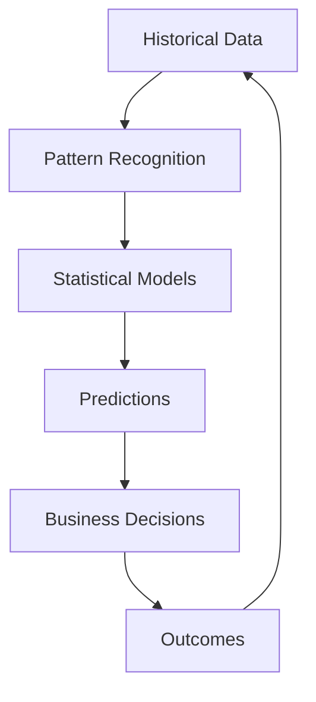

## Beyond the Hype: What Predictive Analytics Really Means

Every day, another headline proclaims that AI will revolutionize business. But between the hype and reality lies a practical question: How can predictive analytics actually help your business today?

After implementing predictive analytics solutions for over 200 companies, I've learned that success isn't about having the most sophisticated algorithms—it's about solving real business problems with the right approach.

## What Is Predictive Analytics?

At its core, predictive analytics uses historical data to make informed predictions about future events. Think of it as turning your rearview mirror into a crystal ball—one based on patterns and probabilities rather than mysticism.

### The Building Blocks



### Key Distinction: Predictive vs. Descriptive

| Analytics Type | Focus | Question | Example |
|----------------|-------|----------|---------|
| **Descriptive** | Past | What happened? | Sales were $2M last quarter |
| **Diagnostic** | Past | Why did it happen? | Sales dropped due to supply issues |
| **Predictive** | Future | What will happen? | Sales will be $2.5M next quarter |
| **Prescriptive** | Future | What should we do? | Increase inventory by 20% |

## Real Business Applications That Work

### 1. Customer Churn Prediction

**The Problem**: A telecom company was losing 15% of customers annually

**The Solution**: 
- Analyzed 50+ behavioral indicators
- Built model predicting churn 3 months out
- Implemented targeted retention campaigns

**The Results**:
```python
# Before predictive analytics
Annual churn rate: 15%
Lost revenue: $45M
Retention cost: $12M (blanket approach)

# After implementation  
Annual churn rate: 9%
Revenue saved: $18M
Retention cost: $6M (targeted approach)
ROI: 300% in year one
```

### 2. Demand Forecasting

**Industry**: Retail Fashion

**Challenge**: 30% of inventory became dead stock

**Predictive Approach**:
- Historical sales patterns
- Weather data integration  
- Social media trend analysis
- Economic indicators

**Outcome**:
- 70% improvement in forecast accuracy
- 50% reduction in dead stock
- 25% decrease in stockouts
- $10M working capital freed up

### 3. Predictive Maintenance

**Scenario**: Manufacturing plant with 200 machines

**Traditional Approach**:
- Fixed maintenance schedules
- Reactive repairs
- 5% unplanned downtime

**Predictive Solution**:
- IoT sensors monitoring vibration, temperature
- ML models predicting failure probability
- Dynamic maintenance scheduling

**Impact**:
- 75% reduction in unplanned downtime
- 30% decrease in maintenance costs
- 20% extension in equipment life
- $15M annual savings

## The ROI of Predictive Analytics

### Calculating Real Returns

```
ROI = (Gain from Investment - Cost of Investment) / Cost of Investment × 100

Where:
- Gain = Revenue increase + Cost savings
- Cost = Technology + Personnel + Implementation + Maintenance
```

### Typical ROI by Industry

| Industry | Average ROI | Payback Period | Primary Use Case |
|----------|-------------|----------------|------------------|
| Retail | 250-400% | 6-9 months | Demand forecasting |
| Financial Services | 300-500% | 4-6 months | Risk assessment |
| Healthcare | 200-350% | 9-12 months | Patient outcomes |
| Manufacturing | 350-450% | 6-8 months | Predictive maintenance |
| Telecom | 300-400% | 5-7 months | Churn prevention |

## Is Your Organization Ready?

### The Predictive Analytics Readiness Assessment

Rate your organization (1-5 scale):

**Data Foundation**
- [ ] Historical data available (2+ years)
- [ ] Data quality is good (>90% complete)
- [ ] Data is accessible
- [ ] Multiple data sources can be integrated

**Technical Capability**
- [ ] Analytics tools in place
- [ ] Technical team available
- [ ] Cloud infrastructure ready
- [ ] Security measures established

**Organizational Readiness**
- [ ] Leadership support exists
- [ ] Clear business problems identified
- [ ] Budget allocated
- [ ] Change management capability

**Scoring**:
- 60-80: Ready to start
- 40-59: Some preparation needed
- <40: Focus on foundations first

## Common Predictive Analytics Use Cases

### By Department

**Sales & Marketing**
- Lead scoring and qualification
- Customer lifetime value prediction
- Campaign response prediction
- Price optimization
- Cross-sell/upsell opportunities

**Operations**
- Demand forecasting
- Supply chain optimization
- Quality prediction
- Resource allocation
- Process optimization

**Finance**
- Cash flow forecasting
- Credit risk assessment
- Fraud detection
- Budget optimization
- Investment analysis

**Human Resources**
- Employee attrition prediction
- Performance forecasting
- Recruitment success prediction
- Training needs analysis
- Workforce planning

## The Implementation Roadmap

### Phase 1: Foundation (Weeks 1-4)

**Week 1-2: Discovery**
```yaml
Activities:
  - Define business problem
  - Identify success metrics
  - Assess data availability
  - Set realistic expectations
  
Deliverables:
  - Project charter
  - Data inventory
  - Success criteria
  - Timeline and budget
```

**Week 3-4: Data Preparation**
- Data collection and integration
- Quality assessment
- Feature engineering
- Exploratory analysis

### Phase 2: Model Development (Weeks 5-8)

**Week 5-6: Initial Modeling**
```python
# Typical model development process
1. Split data (train/validate/test)
2. Try multiple algorithms
3. Evaluate performance
4. Select best approach
5. Refine and optimize
```

**Week 7-8: Validation & Testing**
- Business validation
- Technical testing
- Performance benchmarking
- Bias and fairness checks

### Phase 3: Deployment (Weeks 9-12)

**Week 9-10: Production Setup**
- Infrastructure configuration
- API development
- Integration planning
- Security implementation

**Week 11-12: Launch & Monitor**
- Phased rollout
- User training
- Performance monitoring
- Feedback collection

### Phase 4: Optimization (Ongoing)

- Model retraining schedule
- Performance tracking
- Feature updates
- Scaling plans

## Choosing the Right Approach

### Build vs. Buy vs. Partner

| Approach | Best For | Pros | Cons |
|----------|----------|------|------|
| **Build In-House** | Tech companies with data science teams | Full control, customization | Expensive, time-consuming |
| **Buy Software** | Standard use cases | Quick deployment, proven solutions | Less flexibility, ongoing costs |
| **Partner with Consultants** | Complex/first projects | Expertise, faster results | Knowledge transfer needed |

### Technology Stack Considerations

**Cloud Platforms**
- AWS SageMaker: Comprehensive, scalable
- Google Cloud AI: Strong in deep learning
- Azure ML: Best for Microsoft shops
- Databricks: Unified analytics platform

**Tools by Sophistication**
1. **Beginner**: Excel, Tableau, Power BI
2. **Intermediate**: Python, R, SQL
3. **Advanced**: TensorFlow, PyTorch, Spark

## Common Pitfalls and How to Avoid Them

### 1. Starting Too Big
❌ **Wrong**: "Let's predict everything!"
✅ **Right**: Start with one high-value use case

### 2. Ignoring Data Quality
❌ **Wrong**: "We'll fix data issues later"
✅ **Right**: Invest in data quality upfront

### 3. Black Box Models
❌ **Wrong**: "Trust the algorithm"
✅ **Right**: Ensure interpretability for business users

### 4. Set and Forget
❌ **Wrong**: "The model is deployed, we're done"
✅ **Right**: Plan for continuous monitoring and updates

### 5. Unrealistic Expectations
❌ **Wrong**: "AI will solve all our problems"
✅ **Right**: Set specific, measurable goals

## Success Story: From Insight to Impact

### The Company: Regional Bank

**Challenge**: 
- High loan default rates (8%)
- Manual underwriting process
- Inconsistent decisions
- Long approval times (5 days)

**Predictive Solution**:
```python
# Model Features
- Credit history patterns
- Transaction behavior
- External data (employment, economic)
- Social indicators (with consent)

# Model Performance
- AUC-ROC: 0.89
- Precision: 85%
- Recall: 82%
```

**Implementation Journey**:
1. **Month 1**: Data integration and cleaning
2. **Month 2**: Model development and testing
3. **Month 3**: Pilot with 1,000 applications
4. **Month 4**: Full deployment
5. **Month 5-6**: Optimization and scaling

**Results After 6 Months**:
- Default rate: 8% → 4.5%
- Approval time: 5 days → 2 hours
- Revenue increase: $25M
- Cost savings: $10M
- Customer satisfaction: +30%

## Your Predictive Analytics Checklist

Before starting your journey:

**Business Readiness**
- [ ] Clear problem definition
- [ ] Measurable success metrics
- [ ] Executive sponsorship
- [ ] Budget approved
- [ ] Timeline realistic

**Data Readiness**
- [ ] 2+ years of historical data
- [ ] Data quality assessed
- [ ] Access permissions secured
- [ ] Privacy compliance verified
- [ ] Integration plan ready

**Technical Readiness**
- [ ] Platform selected
- [ ] Team identified
- [ ] Infrastructure ready
- [ ] Security approved
- [ ] Monitoring plan

**Organizational Readiness**
- [ ] Change management plan
- [ ] Training budget
- [ ] Communication strategy
- [ ] Success celebration planned
- [ ] Continuous improvement process

## The Future Is Predictable (With the Right Approach)

Predictive analytics isn't magic—it's a powerful tool that, when applied correctly, can transform how you make decisions. The key is starting with clear business objectives, maintaining realistic expectations, and following a proven implementation path.

Remember: Every company that's successfully using predictive analytics started with a single use case. What will yours be?

---

## Ready to Predict Your Success?

Our team has helped 200+ companies implement predictive analytics solutions with average ROIs exceeding 300%. [Contact us](/consulting_services_website/contact/) for a free consultation and ROI assessment.

### Additional Resources:
- [Predictive Analytics ROI Calculator](/tools/roi-calculator)
- [Industry Use Case Library](/resources/use-cases)
- [Free Readiness Assessment](/assessment/predictive-analytics)

*Dr. James Liu is the Head of Machine Learning at Data Insights Consulting, with a PhD in Statistical Learning and 12 years of experience implementing predictive analytics solutions across industries.*